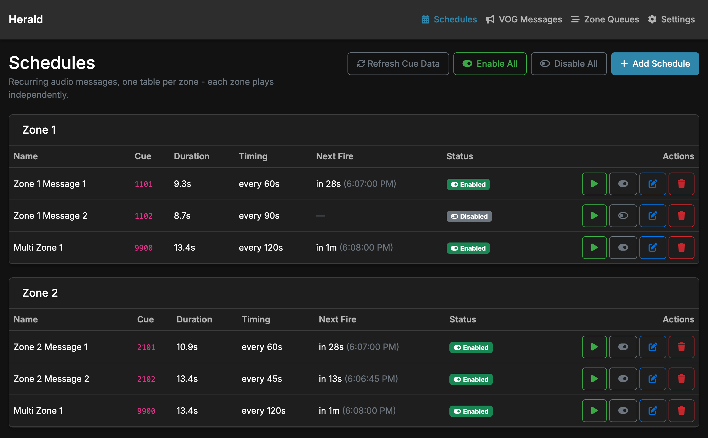
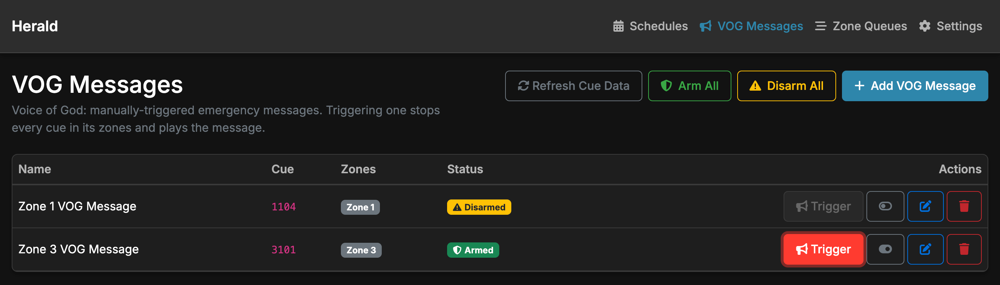
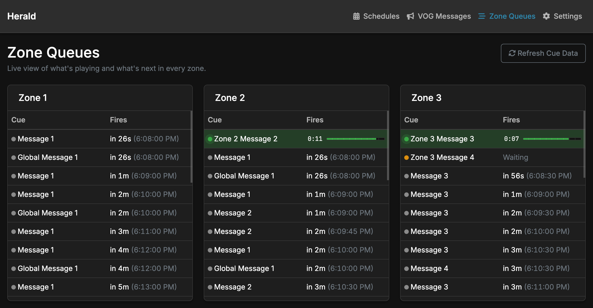
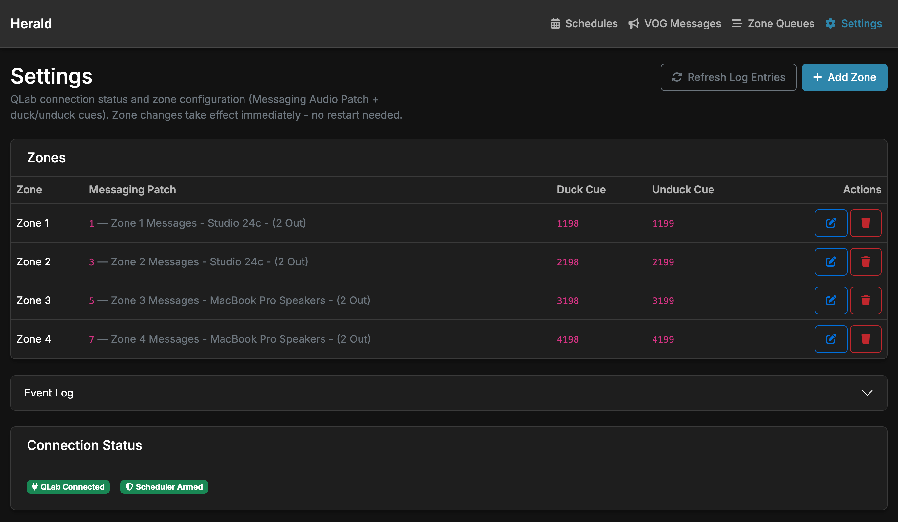
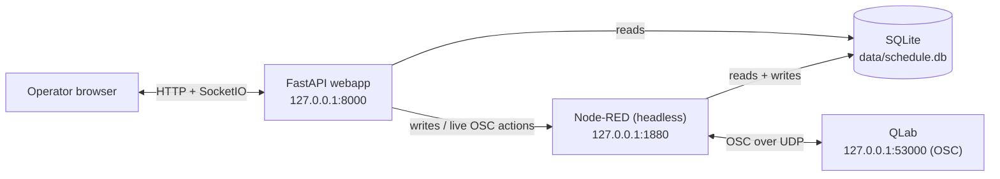

# Herald - The Cue Scheduler for QLab

A scheduling and emergency-messaging layer for [QLab](https://qlab.app). Operators schedule
recurring audio announcements, like safety messages, closing calls, or wayfinding messages,
across independent audio **zones**, and trigger one-tap **Voice-of-God (VOG)** emergency
messages. QLab stays the sole owner of audio; this system owns the timing, the collision
rules, and the operator interface.

Featuring multi-zone support, FIFO queueing withing a collision prevention engine, and an
intuitive GUI, Herald runs entirely on the same Mac as QLab, via loopback OSC.

---

## Features

### Recurring & time-boxed schedules
Play a cue every _N_ seconds/minutes, restricted to an active time window, chosen weekdays, and a
date range. The scheduler stays disarmed until QLab is confirmed live, and missed occurrences
are skipped rather than replayed in a burst.

### One-tap Voice-of-God emergency messaging
A dedicated, manual-only priority tier. Triggering a VOG message stops whatever is playing in
that message's zones, plays the announcement, and does not resume what it interrupted.

### Live Zone Queue visualizer
Every zone runs its own independent queue. This page shows what is playing in each zone,
what is waiting behind it, and what is coming up next.

### Automatic zone derivation
Zones aren't tagged by hand, instead, they're **derived from each cue's QLab Messaging Audio Patch
assignment. The one small manual config file maps a patch to a zone (and its ducking cues);
everything else is discovered live from QLab.

### Health-gated operation & event history
A `/thump` heartbeat keeps the QLab OSC link alive and flips the system to a disconnected/disarmed
state the moment QLab goes away. All business events (`fired`, `queued`, `duck_wait`, `vog_fired`,
health transitions, …) are written to a rotating event log, surfaced in Settings.

### Background music playout
QLab owns all background music playlists. Each zone has an independent playlist, and when a cue
is triggered, the background music is automatically lowered to allow the message to be heard.

---

## Architecture at a glance

Three cooperating processes:

- **QLab** owns all audio. Media, cues, routing, fades, and ducking.
- **Node-RED** (headless — no dashboard of its own) owns scheduling (cron-plus), the per-zone queue
  engine, OSC to QLab, and all writes to SQLite. Business logic lives in plain, unit-tested
  JavaScript modules under [`lib/`](lib), not in flow wiring.
- **The FastAPI webapp** is the operator-facing UI. It **reads SQLite directly** for anything
  displayable and **proxies every write and live-OSC action to Node-RED**, so validation and
  scheduling stay single-sourced in `lib/`.

**How it works in 20 seconds:** a schedule comes due, Node-RED checks QLab is armed, the cue is
enqueued into each of its zones' FIFOs, the zone ducks its background music, the engine confirms
QLab isn't already playing that cue, it fires the cue over OSC, the zone frees and unducks when
the cue finishes.

---

## Documentation

| Chapter | What's inside |
|---|---|
| [01 · Overview](docs/01-overview.md) | The operator problem, what the system does, the hard rules that shaped it |
| [02 · Architecture](docs/02-architecture.md) | The three-process split, the read-direct/write-proxy rule, data flow |
| [03 · Domain concepts](docs/03-domain-concepts.md) | Zones, schedules, VOG, cues & cache, ducking, health/arming |
| [04 · Queue engine](docs/04-queue-engine.md) | Collision handling, confirm-before-fire, ducking — and the ADR behind it |
| [05 · Configuration](docs/05-configuration.md) | Env vars, `audio-patch-map.json`, the SQLite schema, logging |
| [06 · Development](docs/06-development.md) | Repo layout, module map, running locally, tests, tooling |
| [07 · Deployment & operations](docs/07-deployment-operations.md) | launchd auto-start, restarts, logs, troubleshooting |
| [08 · API reference](docs/08-api-reference.md) | Node-RED internal API + FastAPI routes |
| [ADRs](docs/adr/README.md) | Zone-queue engine decision records (11 ADRs) — the full rationale |

## Quick start

The system is designed to run under launchd on the production Mac; see
[07 · Deployment & operations](docs/07-deployment-operations.md).
For local development, running the engine and webapp by hand, tests, and linting, see
[06 · Development](docs/06-development.md).
