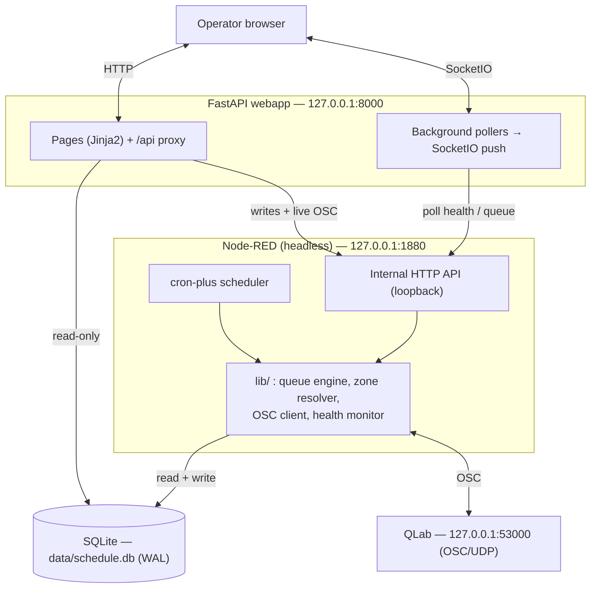
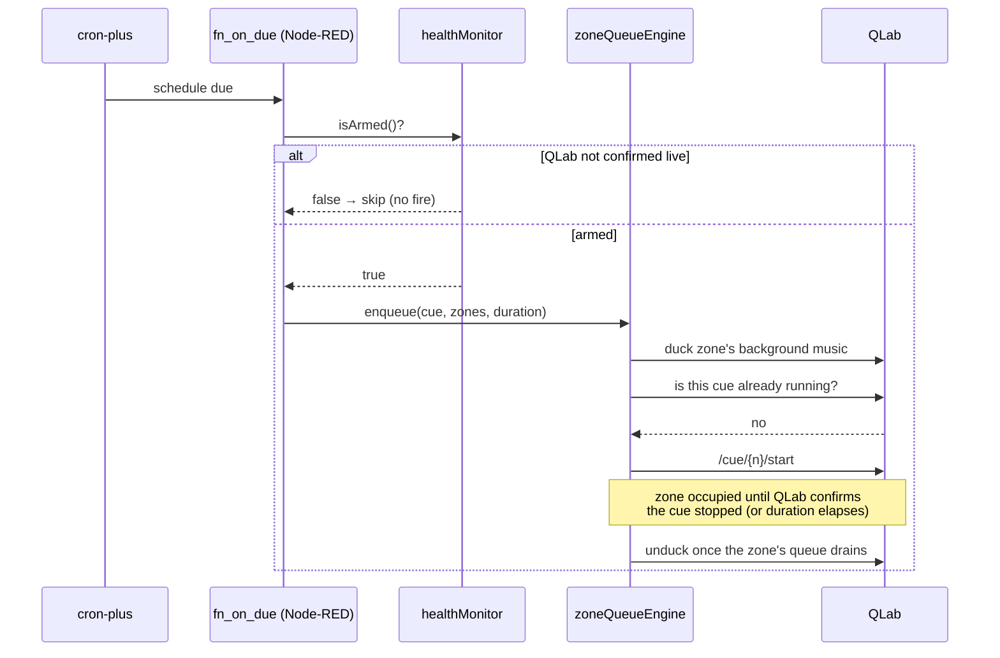

# 02 · Architecture

The system is three cooperating processes on one Mac, all bound to loopback.

## Who owns what

| Process | Owns | Never does |
|---|---|---|
| **QLab** | All audio: media, cues, routing, fades, ducking cues | Scheduling, timing, collision logic |
| **Node-RED** (headless) | cron-plus scheduling, the per-zone queue engine, OSC to QLab, all SQLite **writes** | Serve any UI of its own |
| **FastAPI webapp** | The operator UI, SQLite **reads**, real-time push to the browser | Talk OSC to QLab; write to SQLite |

All non-trivial logic lives in plain, unit-testable JavaScript under [`lib/`](../lib) — the OSC
protocol, zone derivation, schedule validation, cron sync, the queue engine, VOG, and the health
monitor. Node-RED Function nodes are thin wrappers that call into it (see
[06 · Development](06-development.md) for the module map). This is the whole point of the design:
the hard logic is testable in isolation, not trapped in flow wiring.

## The read-direct / write-proxy rule

This one rule governs the FastAPI ↔ Node-RED split:

> **FastAPI reads SQLite directly (read-only) for everything displayable. Every write to
> `schedules`/`vog_messages`/zones, and everything needing the live OSC connection, is proxied to
> Node-RED.**

Reads (schedule lists, VOG lists, cached cue data) are plain read-only SQLite queries — safe
alongside Node-RED's writes thanks to WAL mode, and they don't require a second process to be up
just to render a page. Writes go through Node-RED so that schedule validation (`scheduleModel.js`)
and cron-plus synchronization (`cronSync.js`) are **single-sourced in `lib/`** and never
reimplemented in Python. Pydantic models in the webapp mirror the validation rules for instant
client-side feedback only — Node-RED remains the authority on every write.

The webapp's [`node_red_client.py`](../webapp/app/node_red_client.py) is the single place that knows
Node-RED's endpoint shapes; it collapses every connection failure to a clean 503 so a page never
hangs when Node-RED is down.

## Why headless Node-RED + a separate FastAPI app

The operator UI was originally built in Node-RED's own dashboard framework, which hit walls that
couldn't be fixed from this side. It was replaced by a **headless Node-RED engine with a small
internal JSON API** plus a separate FastAPI UI — a UI-layer swap only, with no change to any `lib/`
logic. That internal API is plain HTTP nodes bound to `127.0.0.1`, since only the co-located webapp
calls it.

## A scheduled fire, end to end

For the full collision/tie-break behavior behind `enqueue`, see
[04 · Queue engine](04-queue-engine.md).
